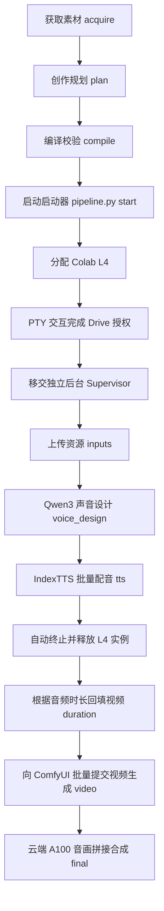

# Vidio 项目核心记忆与架构全景手册 (PROJECT_MEMORY.md)

> **关于此文档**：本文档是 `vidio` 项目的权威知识库与长期记忆。后续任何对话、任务交接或新 Agent 介入时，可直接读取本文档获取项目的完整上下文、工程规范与执行方式，无需用户重复介绍。

---

## 1. 项目定位与核心使命

- **项目名称**：`vidio`
- **业务定位**：将开源开放授权（如 Book Dash、StoryWeaver 等 CC BY 4.0）的高品质儿童图画绘本，通过 AI 视频与语音合成技术，自动化/半自动化转化为高质量有声动画绘本（Animated Audio Storybooks）。
- **目标产物**：保持原书画风构图的高画质 16:9（或原书比例）视频画面，配以自然生动的多角色旁白/对白、情感起伏的语音，最终合成 1280×720 / 24fps 的完整动画短片。

---

## 2. 核心技术栈与架构设计

### 2.1 视频生成 (Video / I2V)
- **核心模型**：**MiniMax H3** (Hailuo / MiniMax-H3 Image-to-Video)。
- **运行环境**：**ComfyUI** 搭配自定义工作流 (`templates/minimax_h3_i2v/workflow_api.json`)。
- **渲染规格**：默认 **16:9 (Widescreen)**，约 **0.9 Megapixels**（平衡绘本画面构图与手势动作可读性），首帧单参考图驱动。
- **优化与探索**：支持 FastH3 / VSA (Block Sparse Attention) 加速探索。
- **调度接口**：通过 `scripts/comfy_batch.py`，以 HTTP API 与运行中的 ComfyUI 服务交互。输出路径直写 Google Drive (`MyDrive/vidio/books/<book_slug>/video/shots/`)，本地不下载大型视频文件。

### 2.2 语音设计与合成 (Voice & TTS)
- **角色声音设计**：**Qwen3-TTS VoiceDesign**。
  - 根据故事角色的性格、年龄与情境提示词，生成若干候选参考音频（`voices/candidates/`），经筛选后确定角色基准音色（`voices/selected/<role_id>.wav`）。
- **批量语音合成**：**IndexTTS 2.5**。
  - 针对分镜中所有台词（lines），基于选定角色的参考音频，结合情感向量（`emotion_vector`: 8 维情感 `[happy, angry, sad, afraid, disgusted, melancholic, surprised, calm]`）、语速倍率（`duration_factor`）批量合成高保真语音（`audio/lines/<audio_id>.wav`）。
  - **时长反向绑定机制**：TTS 质检完成后，系统测量各句音频实际秒数，计算每个镜头的总音频时长加 1 秒自然尾部缓冲（最小 5 秒），并在提交前动态更新至视频生成工作流的 `duration_seconds`，确保音画时长完美契合。

### 2.3 云端算力管理 (Google Colab & Colab CLI)
- **存储中心**：所有项目数据、模型权重均存放于共享的 Google Drive 根目录：`/content/drive/MyDrive/vidio/`。
  - 模型存储：`MyDrive/vidio/models/IndexTTS-2.5` 等可复用模型。
  - 书籍成果：`MyDrive/vidio/books/<book_slug>/`。
- **算力实例分工与生命周期**：
  1. **L4 GPU 实例**（按需创建、用后即销毁）：
     - 专门运行 TTS 阶段（Qwen3-TTS + IndexTTS 2.5）。
     - 实例命名：`bookdash-<book_slug>-tts-<short_id>`。
     - 运行完毕或发生致命错误时，必须由 Supervisor 严格调用 `colab stop -s <session>` 彻底释放，杜绝闲置扣费。
  2. **A100 High-Mem 实例**（按需保活、复用）：
     - 运行 ComfyUI 图像到视频服务，配置 Cloudflare Tunnel 暴露公开 HTTPS 访问端点。
     - 最终视频合成：当用户请求生成带配音的最终成品时，在挂载了同一 Drive 的 A100 会话中运行 `assemble_final.py`，直接在云端合成，避免本地网络 I/O 开销。

---

## 3. 流水线阶段与运行机制

整个流水线遵循 **创作规划 (Creative Planning)** 与 **后台执行 (Supervisor Execution)** 彻底解耦的原则：



### 3.1 各阶段状态说明 (`status.json` / `state.json`)
1. **`acquire`**：下载/提取原书插画与文字，清洗掉页面上的文字排版，保留纯净插图原画；记录版权 Attribution。
2. **`plan`**：人工或大模型制定 `planning/production_plan.json`：
   - 定义角色声音描述 (`roles`)；
   - 规定镜头分镜 (`shots`)、画面提示词 (`prompt`)、参考底图 (`reference_image`)；
   - 规划镜头归属台词 (`lines`)、情感向量与语速。
3. **`compile`**：校验契约合法性，计算输入哈希（`plan_hash`），生成 `voice_specs.json`、`tts_manifest.json`、`video_manifest.json`。
4. **`l4` / `drive`**：拉起 L4 实例并在前台 PTY 中完成 Google Drive 授权挂载，通过结构化 probe 探针检验读写正常。
5. **`voice_design` & `tts`**：远端执行语音设计与台词合成，质检后同步清单至本地。
6. **`video`**：读取 `url` 中的 ComfyUI 节点，上锁并向 ComfyUI 提交所有视频分镜生成任务，监听完成情况。
7. **`final`**（可选）：在 A100 上调用 `assemble_final.py`，拼接生成最终的 `narrated_final.mp4`。

---

## 4. AI Agent 关键工程哲学与不可逾越的规则 (Invariants)

本项目在工程与 Agent 交互上有着极高标准的规范（参考 `docs/ai-agent-token-optimization-colab-case.md`）：

1. **Token 消耗优化哲学**：
   - **监听不等于回传**：远程执行繁重安装或运行任务时，脚本应在远端完整捕获日志，但禁止直接逐行刷屏给 Agent。
   - **正常静默，异常取样**：成功时仅返回状态摘要；失败时仅截取末尾 20 行日志。
   - **用结构化验证替代日志猜测**：不依赖匹配 `Successfully installed` 等控制台输出，而是用单独的 Python 探针（probe）断言实际状态（如版本号、文件哈希、读写能力），输出标准化 JSON。
2. **零睡眠轮询机制 (No Agent Sleep/Polling Loops)**：
   - 启动管道后，`pipeline.py start` 移交给 detached 独立后台进程（Supervisor），Agent 立即交还控制权。
   - 严禁 Agent 使用 `sleep` 或重复调用工具在循环中轮询状态。需要看进度时，只在用户询问或明确下一步时单次调用 `pipeline.py status`。
3. **GPU 实例与账单管理**：
   - L4 实例独立归属各单本书，完成 TTS 或遇到致命异常后必须执行 `colab stop` 彻底关闭；
   - 绝不随意改变 GPU 规格（如擅自把 A100 降为 T4 或增加无用实例）。
4. **幂等性与数据一致性**：
   - 任何改动不能破坏已经跑完的阶段资产；
   - 冻结的计划哈希（`plan_hash`）防止在不一致的输入下误用过时产物。

---

## 5. 项目文件目录骨架

```text
/home/eric/Projects/vidio/
├── .agents/
│   └── skills/
│       ├── bookdash-animation-pipeline/    # 核心管道技能（包含 pipeline.py、schemas 等）
│       └── colab-comfyui-session/          # ComfyUI 会话管理技能（A100、Cloudflare 穿透）
├── books/                                  # 绘本书籍工程目录
│   ├── 444797-where-is-your-school/        # [最新进行中] StoryWeaver 绘本
│   ├── khaya-wants-to-row/                 # 已完成音频设计与 TTS
│   ├── moms-hands-sasl/                    # 已完成全流程（含 final 合成视频）
│   └── the-window-seat/                    # 已完成规划准备
├── docs/
│   └── ai-agent-token-optimization-colab-case.md  # Token 优化与 Agent 设计经典案例
├── notebooks/                              # 基础 Jupyter 笔记本 (ComfyUI Colab 启动等)
├── scripts/                                # 辅助与验证脚本
├── url                                     # 当前活跃的 ComfyUI Cloudflare 穿透地址
└── PROJECT_MEMORY.md                       # [本文档] 项目核心记忆文件
```

---

## 6. 当前项目各书籍进展快照

| 书籍目录 (`book_slug`) | 来源 | 当前状态 | 核心进度与下一步 |
|---|---|---|---|
| `444797-where-is-your-school` | StoryWeaver (Pratham Books) | **创作规划已就绪** (`plan: succeeded`) | 14 个分镜、16 条配音规划完毕。等待配置 ComfyUI URL 后启动 TTS/Video 管道。 |
| `khaya-wants-to-row` | Book Dash | **TTS 已完成** (`tts: succeeded`) | 配音已就绪。视频阶段曾因 ComfyUI 退出报错，待接入健康的 ComfyUI URL 进行断点重试。 |
| `moms-hands-sasl` | Book Dash (南非手语) | **全流程已完成** (`final: succeeded`) | 产出 69.8 秒的最终合成视频 `narrated_final.mp4`。 |
| `the-window-seat` | Book Dash | **创作规划已就绪** (`plan: succeeded`) | 12 个分镜、19 个 TTS 任务。等待启动 L4 进行音频合成。 |

---

## 7. 常用操作速查手册

### 7.1 启动或检查 ComfyUI 服务
- 查看当前 ComfyUI 地址：`cat url`
- 检查 ComfyUI 服务健康度：`curl -s $(cat url)/system_stats`
- 若未启动，可使用 `colab-comfyui-session` 技能规范，在 A100 High-Mem 实例上启动 `notebooks/ComfyUIonColab_cli.ipynb`。

### 7.2 启动或恢复某本书的流水线
```bash
# 1. 验证生产计划与素材完整性
python .agents/skills/bookdash-animation-pipeline/scripts/pipeline.py validate --book-dir books/<book_slug>

# 2. 编译生产清单
python .agents/skills/bookdash-animation-pipeline/scripts/pipeline.py compile --book-dir books/<book_slug>

# 3. 启动流水线 (需在支持交互的 PTY 中运行以完成 Drive 授权)
python .agents/skills/bookdash-animation-pipeline/scripts/pipeline.py start \
  --book-dir books/<book_slug> \
  --comfy-url $(cat url)

# 4. 查看当前阶段状态（非轮询，单次查询）
python .agents/skills/bookdash-animation-pipeline/scripts/pipeline.py status --book-dir books/<book_slug>

# 5. 紧急释放该书占用的 L4 实例（如异常中断清理）
python .agents/skills/bookdash-animation-pipeline/scripts/pipeline.py stop-l4 --book-dir books/<book_slug>
```
